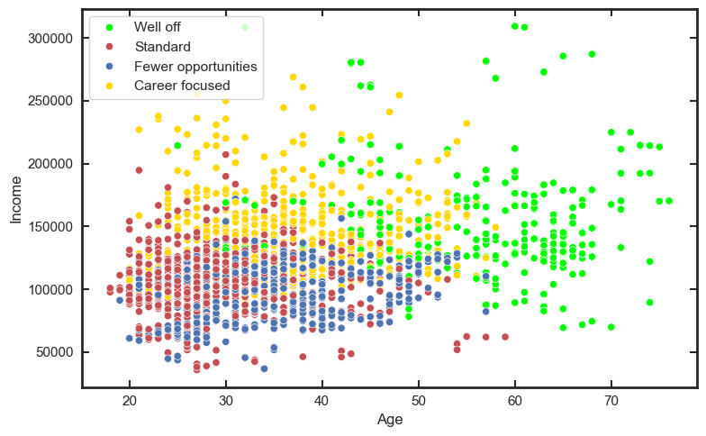
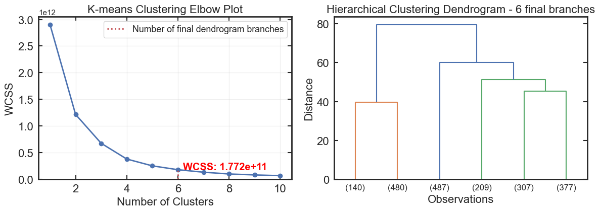
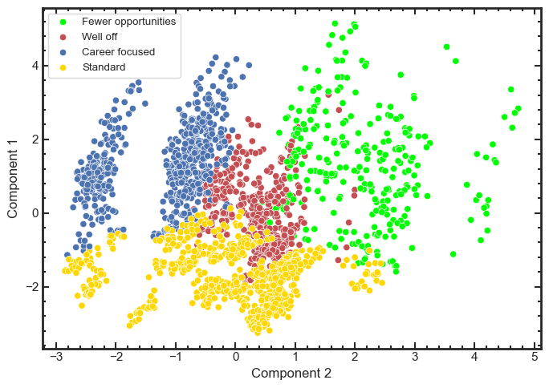

# Clustering & Segmentation Workbench

An interactive Streamlit workbench for exploratory unsupervised learning using correlation analysis, hierarchical clustering, K-means segmentation and principal component analysis (PCA).

The project began as a Jupyter clustering pipeline and has been developed into a reusable application that can be applied to the built-in customer segmentation example, uploaded CSV files, or remote CSV URLs.

<h4 align="center">
  Live app:
  <a href="https://clustering-segmentation.streamlit.app">
    clustering-segmentation.streamlit.app
  </a>
</h4>



*Generated from the [Kaggle Customer Clustering dataset](https://www.kaggle.com/datasets/dev0914sharma/customer-clustering)
by dev0914sharma — not the bundled synthetic demo data described below.*


## Features

### Flexible data input
- Built-in customer segmentation example
- Upload a local CSV
- Load a CSV directly from a URL
- Select the numeric features used in the analysis
- Drop missing rows or apply median imputation
- Preview large datasets without rendering the entire file

### Correlation analysis
- Pearson correlation heatmap
- Adjustable absolute correlation threshold
- Ranked table of strongly correlated feature pairs

### Hierarchical clustering
- Ward-linkage hierarchical clustering
- Adjustable dendrogram branch count
- Configurable dendrogram sample size for large datasets
- K-means within-cluster sum-of-squares (WCSS) elbow diagnostic


*Generated from the [Kaggle Customer Clustering dataset](https://www.kaggle.com/datasets/dev0914sharma/customer-clustering)
by dev0914sharma — not the bundled synthetic demo data described below.*


### K-means segmentation
- Standardised feature space
- Adjustable number of clusters
- Interactive choice of X and Y variables for visualisation
- Consistent colour and marker identity for each cluster
- WCSS and silhouette diagnostics
- Human-readable cluster relabelling directly beneath the segmentation plot

### Cluster interpretation
- Mean feature profile by cluster
- Cluster size and proportion
- Custom group labels carried through the analysis
- Downloadable clustered CSV

### Principal component analysis


*Generated from the [Kaggle Customer Clustering dataset](https://www.kaggle.com/datasets/dev0914sharma/customer-clustering)
by dev0914sharma — not the bundled synthetic demo data described below.*


- Automatic PCA component selection using an explained-variance target
- Manual component-count override
- Explained-variance diagnostics
- K-means clustering in retained PCA space
- Interactive PCA component-pair visualisation
- Silhouette score for the full retained PCA space
- 2D silhouette score for the currently displayed component pair
- Ranking of PCA component pairs by 2D cluster separation
- Downloadable PCA loadings


## Repository structure

```text
clustering-segmentation-workbench/
├── app/
│   └── app.py
├── data/
│   └── customer-segmentation.csv
├── notebooks/
│   └── cluster-pipeline.ipynb
├── assets/
│   └── images/
├── README.md
├── requirements.txt
└── .gitignore
```

## Run locally

From the repository root:

```bash
python -m venv .venv
source .venv/bin/activate
pip install -r requirements.txt
streamlit run app/app.py
```

The application will normally open at:

```text
http://localhost:8501
```

## Requirements

```text
streamlit
pandas
numpy
matplotlib
scipy
scikit-learn
```
## Data

The bundled example dataset is fully synthetic, generated for this project
(see generate_dataset.py) — its column structure mirrors the Kaggle
["Customer Clustering"](https://www.kaggle.com/datasets/dev0914sharma/customer-clustering) dataset by dev0914sharma, which the app's exploratory workflow was originally inspired by, but the values are entirely invented rather than redistributed from that source.
   
## Workflow

1. **Load data** — choose the built-in dataset, upload a CSV, or provide a remote CSV URL.
2. **Choose features** — select the numeric variables to include in the clustering analysis.
3. **Inspect correlation structure** — explore pairwise Pearson correlations and identify potentially redundant or strongly related variables.
4. **Explore hierarchical structure** — use the dendrogram and WCSS elbow curve to investigate plausible cluster structure.
5. **Fit K-means clusters** — cluster the standardised feature matrix and inspect the groups using selected feature dimensions.
6. **Interpret and relabel clusters** — replace numerical cluster IDs with meaningful names based on the observed group profiles.
7. **Inspect cluster profiles** — compare feature means, cluster sizes and proportions.
8. **Reduce dimensionality with PCA** — select the number of retained components automatically or manually.
9. **Assess PCA-space separation** — re-fit K-means in PCA space and compare alternative 2D component pairings using silhouette score.

## Methodology

### Standardisation

K-means and hierarchical clustering are distance-based methods, so numeric features are standardised before clustering.

### Correlation analysis

Pearson correlation is used to inspect linear relationships between selected numeric features. The threshold control affects only the table of stronger relationships; the complete correlation matrix remains visible in the heatmap.

### Hierarchical clustering

Ward linkage is used to explore how observations merge into progressively larger groups.

Hierarchical clustering becomes expensive for large datasets, so the dendrogram can be calculated from a reproducible sample. This sampling affects only the dendrogram; the K-means diagnostics continue to use the full analysed dataset.

### K-means

K-means clustering is fitted with a fixed random seed for reproducibility. Cluster quality is assessed using:

- **WCSS** — compactness within clusters
- **Silhouette score** — separation between clusters

These diagnostics should be considered alongside domain interpretation rather than used as automatic optimisation targets.

### PCA

PCA is used to reduce dimensionality while retaining as much variance as possible.

The application reports both:

- the silhouette score in the **full retained PCA space**
- the silhouette score for the **currently displayed 2D PCA component pair**

It also compares all available component pairs so that the user can identify which two-dimensional projection provides the clearest cluster separation.

A high-scoring 2D projection is useful for visual interpretation, but it does not necessarily mean that those two components are the most important representation of the dataset overall.

## Cluster interpretation

Cluster numbers are arbitrary labels produced by K-means.

The workbench therefore keeps cluster colours and marker shapes consistent throughout the application while allowing the user to replace labels such as `Cluster 0` with meaningful descriptive names.

Those labels are then reused in:

- K-means plots
- cluster profile tables
- PCA visualisations
- downloaded clustered data

## Notes

This application is intended for **exploratory segmentation** rather than automatic decision-making.

Useful clustering should be judged using a combination of:

- statistical separation
- stability
- interpretability
- domain relevance
- downstream usefulness

A mathematically distinct cluster is not necessarily a meaningful or actionable segment.

## Original notebook

The original analytical workflow is retained in:

```text
notebooks/cluster-pipeline.ipynb
```

This provides a notebook-based version of the analysis alongside the reusable Streamlit application.
